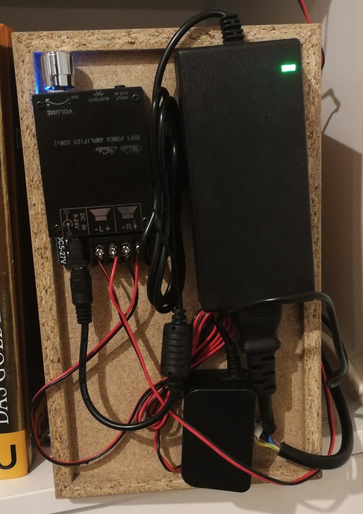

# Webradio
An Internet radio project running on an bulky outdoor tablet looking for purpose.
Two solutions were tested and evaluated:
  *. Ubuntu 20.04: see **ubuntu** branch
  *. Android-x86: see below

## Introduction
The decision to switch to an Android OS was made after testing Ubuntu 20.04 on the tablet for a few days. Overall boot was pretty slow, desktop version is not optimized for these kind of resolutions and touch screens and the app, despite being really beautiful and quite intuitive, stopped working out of nowhere. Moreover Android is offering a lot more possibilities in user management and the Google PlayStore has everything needed.

## Setup
* Download Android-x86, I used version 7.1-r4 (fourth release of Android Nougat)
* Create a bootable USB drive
* Plug in the tablet, boot from the drive and let install following this [guide](https://www.android-x86.org/installhowto.html)
* On the first boot, log in with your Google account and set it as you wish.
  * I installed MyTuner and TuneIn apps for internet radio, as well as Spotify 

## Usage
The use of the apps are pretty straight forward :)

## HW
* **Tablet:** Aava Inari 8
* **Amplifier:** [502C HIFI 2x50W TPA3116](https://www.banggood.com/502C-HIFI-2x50W-TPA3116-AUX+-bluetooth-5_0-HIFI-High-Power-Digital-Amplifier-Stereo-Board-AMP-Amplificador-Home-Theater-p-1582750.html?ID=6278569&cur_warehouse=UK)
* **Speakers:** Sony 2x50W

> :warning: **SPOILER ALERT:** I am not a hardware engineer, neither really good with hardware

I litterally glued eveything to the back of one speaker. Because the tablet battery is crap, I tore open a micro-USB charger and soldered it in parallel to the amplifier power supply. Until now, nobody got electrocuted so I'll consider that a success.

